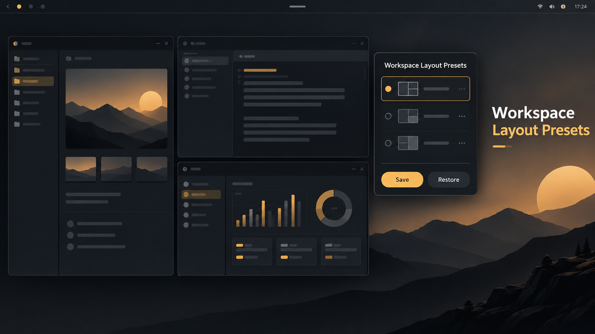

# Workspace Layout Presets



A small Omarchy bar widget that saves the arrangement of the current workspace
and restores it later into an empty workspace.

It is intentionally narrower and safer than a session manager: one preset is
one workspace, restoring is always explicit, and existing windows are never
closed, moved, or rearranged.

## What it does

- Saves named presets for the active workspace.
- Restores tiled Dwindle splits and floating-window geometry.
- Opens applications through installed `.desktop` entries.
- Shows a read-only preview before anything is launched.
- Refuses to restore unless the active workspace is empty and compatible.
- Reports partial results without attempting a destructive rollback.

Workspace Layout Presets does **not** save browser tabs, URLs, documents,
terminal history, process command lines, credentials, or whole-desktop
sessions. It has no autostart or automatic restore behavior.

## Requirements

- Omarchy 4.x with the Quattro plugin runtime
- Hyprland 0.56 or newer
- The Hyprland `dwindle` layout
- Python 3.11 or newer
- `hyprctl` and the standard Omarchy desktop-entry locations

The first public beta was tested on Omarchy 4.0.2, Hyprland 0.56.2, and
Quickshell 0.3.1. A fresh runtime compatibility check is performed before every
restore; an unsupported or unverified environment is blocked without changing
the desktop.

## Install

```sh
omarchy plugin add https://github.com/smariconde/omarchy-workspace-layout-presets.git --enable
```

The plugin appears in the right side of the bar by default. If needed, enable
or move it explicitly:

```sh
omarchy plugin enable io.github.smariconde.workspace-layout-presets right
omarchy bar move io.github.smariconde.workspace-layout-presets --section right
```

Third-party Omarchy plugins run with your user permissions. Review the source
before enabling any plugin.

## Use

1. Arrange the windows in the workspace you want to remember.
2. Open the bar widget, enter a name, and select **Save**.
3. Switch to an empty regular workspace.
4. Select the preset, choose **Restore…**, review the preview, and confirm.

When a browser window could represent either the browser or an installed
webapp, the save flow asks you to choose the intended application. The window
title is used only for that temporary review and is not written to the preset.

## Stored data

Presets are private, human-readable JSON files stored under:

```text
$XDG_DATA_HOME/omarchy-workspace-layout-presets/profiles/
```

If `XDG_DATA_HOME` is unset, the fallback is:

```text
$HOME/.local/share/omarchy-workspace-layout-presets/profiles/
```

Removing the plugin does not remove these presets, so an uninstall cannot
silently destroy user data.

## Remove

```sh
omarchy plugin remove io.github.smariconde.workspace-layout-presets
```

To remove the saved presets as well, inspect the directory first and then
delete it yourself. The plugin never performs this cleanup automatically.

## Compatibility and limitations

- A preset describes one workspace only.
- Restore requires an empty active workspace.
- Exact tree reconstruction supports representable Dwindle slicing geometry.
- Unsupported geometry is saved with an explicit launch-order fallback.
- Repeated indistinguishable windows are restored on a best-effort basis.
- Missing or unsafe launchers are skipped and reported.
- `master`, `scrolling`, grouped/tabbed, special-workspace, and multi-workspace
  restoration are outside the current scope.

## Development

Run the test suite and manifest validation from the repository root:

```sh
python -m unittest discover -v
python tools/check_release_payload.py
omarchy plugin validate .
```

When `qmllint` is installed, validate the QML against the Omarchy shell imports:

```sh
qmllint -I /usr/share/omarchy/shell BarWidget.qml Panel.qml qml/*.qml
```

The backend uses only the Python standard library. See
[CONTRIBUTING.md](CONTRIBUTING.md) before proposing behavioral changes and
[SECURITY.md](SECURITY.md) for private vulnerability reporting.

## Versions

Releases follow [Semantic Versioning](https://semver.org/). The version in
`manifest.json` is the runtime source of truth and is displayed in the plugin
panel. Published Git tags use the same value with a `v` prefix, such as
`v0.1.0`. See [docs/releasing.md](docs/releasing.md) for the release process and
[CHANGELOG.md](CHANGELOG.md) for user-visible changes.

## License

Released under the [MIT License](LICENSE).

## Project documentation

- [Repository guide](docs/repository-guide.md)
- [Product and technical specification](spec.md)
- [Architecture and contracts](docs/architecture.md)
- [Development roadmap](docs/development-plan.md)
